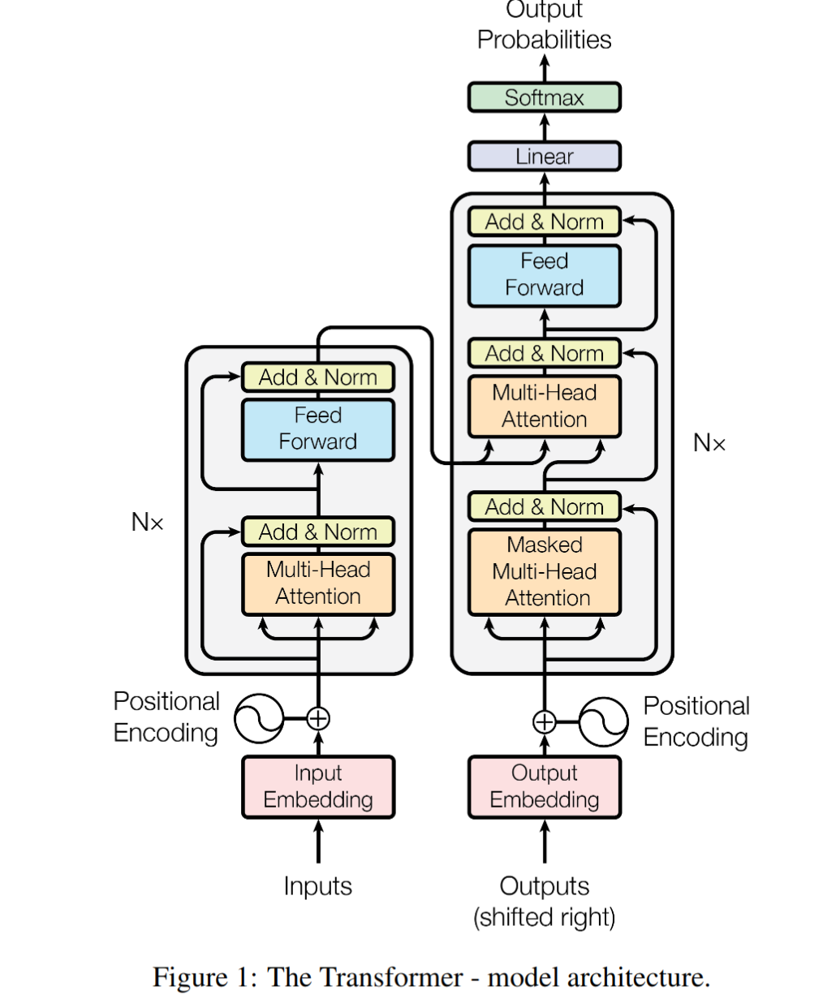
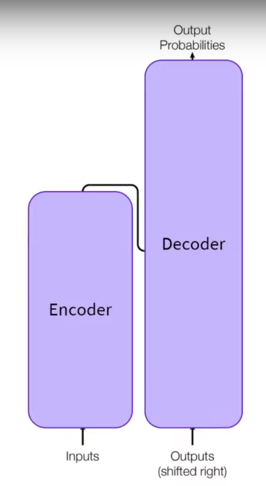
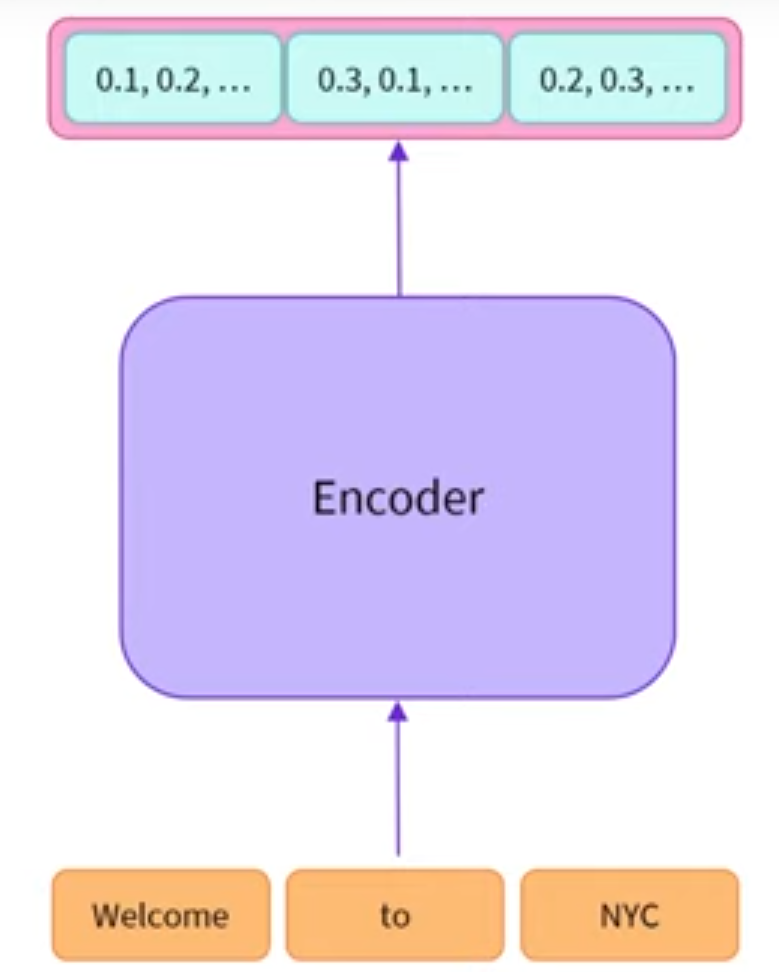

# Initial Research

This file details the initial research into the feasibility of Creating Awesome Text Org. (CATO). 
The file deals with gathering information on the current models and methods used within this space. 

Disclaimer: 
ChatGPT and the following sourced were used in the creation of this document:
- https://huggingface.co/learn/nlp-course/chapter1/4 

### What is a Large Language Model
A Large Language Model (LLM) is a form of Artificial Intelligence that is capable of generating human-like responses. 

It is build using deep learning techniques and utilizes a form of neural network known as a transformer. 
The transformer model enables efficient parallel analysis of text making it suitable for large scale issues. 

For further information on transformer models, please review the following article: [All You Need is Attention](https://arxiv.org/pdf/1706.03762.pdf)

LLMs are trained on vast amounts of text data to learn the statistical patterns and structures of human language. 
This training data often consists of a diverse range of sources, such as books, articles, websites, and more, allowing the model to gain a broad understanding of various language patterns and nuances.

LLMs have demonstrated impressive capabilities in understanding context, generating coherent responses, 
and even simulating human-like conversations. They have a wide range of applications across natural language 
processing (NLP) tasks and have significantly impacted the fields of AI research and applications. 
However, it's important to be aware that these models also raise ethical concerns related to misinformation, 
bias, privacy, and misuse, which researchers and developers actively work to address.

### Transformer Model
The original article creating the transformer architecture is titled *Attention is all you need*. 
They propose the following model structure:

    

This can be simplified to comprised of two pieces, an Encoder and a Decoder:

    

### Encoder
The encoder element accepts text as input. 
The text is transformed into a numerical representation. These features are also known as a **feature vector** or **feature tensor**. 
In short, a feature is a numerical vector per word given as input to the encoder.

It is important to note that the feature per word is contextualized, such that the vector generated takes into 
account the surrounding words (context). 
This is achieved using the **self attention** mechanism.

    

The self attention mechanism allows the model to weigh the importance of different words in an input sequence when processing each word. The self-attention mechanism computes attention scores between all words in the sequence simultaneously.

This allows for capturing of dependencies between words, regardless of their positions allowing a highly efficient contextual understanding.

#### When to use an  encoder?
- Bidirectional- contextual from left to right
- Extract meaningful information
- Sequence classification, question asking, masked language modelling, etc.
- Sentiment analysis
- NLU: Natural language understanding.