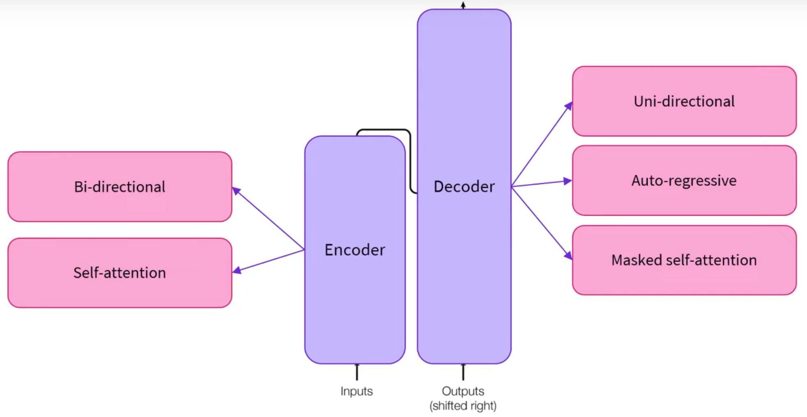

# Initial Research

This file details the initial research into the feasibility of Creating Awesome Text Org. (CATO). 
The file deals with gathering information on the current models and methods used within this space. 

Disclaimer: 
ChatGPT and the following sourced were used in the creation of this document:
- https://huggingface.co/learn/nlp-course/chapter1/4 
- The Hugging Face website https://huggingface.co/learn/nlp-course/chapter1/4 provided the majority of the information 
relating to transformers/ encoders/ decoders and the visuals are taken from their published videos. 

### What is a Large Language Model
A Large Language Model (LLM) is a form of Artificial Intelligence that is capable of generating human-like responses. 

It is build using deep learning techniques and utilizes a form of neural network known as a transformer. 
The transformer model enables efficient parallel analysis of text making it suitable for large scale issues. 

For further information on transformer models, please review the following article: [All You Need is Attention](https://arxiv.org/pdf/1706.03762.pdf)

LLMs are trained on vast amounts of text data to learn the statistical patterns and structures of human language. 
This training data often consists of a diverse range of sources, such as books, articles, websites, and more, allowing the model to gain a broad understanding of various language patterns and nuances.

LLMs have demonstrated impressive capabilities in understanding context, generating coherent responses, 
and even simulating human-like conversations. They have a wide range of applications across natural language 
processing (NLP) tasks and have significantly impacted the fields of AI research and applications. 
However, it's important to be aware that these models also raise ethical concerns related to misinformation, 
bias, privacy, and misuse, which researchers and developers actively work to address.

### Transformer Model
The original article creating the transformer architecture is titled *Attention is all you need*. 
They propose the following model structure:

    

This can be simplified to comprised of two pieces, an Encoder and a Decoder:

    

### Encoder
The encoder element accepts text as input. 
The text is transformed into a numerical representation. These features are also known as a **feature vector** or **feature tensor**. 
In short, a feature is a numerical vector per word given as input to the encoder.

It is important to note that the feature per word is contextualized, such that the vector generated takes into 
account the surrounding words (context). 
This is achieved using the **self attention** mechanism.

    

The self attention mechanism allows the model to weigh the importance of different words in an input sequence when processing each word. The self-attention mechanism computes attention scores between all words in the sequence simultaneously.

This allows for capturing of dependencies between words, regardless of their positions allowing a highly efficient contextual understanding.

#### When to use an  encoder?
- Bidirectional- contextual from left to right
- Extract meaningful information
- Sequence classification, question asking, masked language modelling, etc.
- Sentiment analysis
- NLU: Natural language understanding.

### Decoder
The decoder functions similarly to an encoder (at a lesser performs when individual performance is compared)

The input text is converted into the same numerical representation (feature vector/ feature tensor) as 
described in Encoders.

The critical difference between encoders and decoders lies in the self attention mechanism.
The Decoder makes use of a masked self attention mechanism.

The right or left context (left or right of the current word) is masked such that the bi-directional 
(access to all the input words) is limited to only the right/ left context.

Please note that in the context of LLM models, decoders receive numerical feature vectors as inputs, 
however as standalone models they can also receive text as input.

#### When to use a Decoder
- Unidirectional- access to the left or right context
- Causal tasks (generating sequences)
- NLG: Natural Language Generation

Note: Models that can access only the words before the sentence are called auto-regressive models. 

### LLM Summary
The Encoder module receives an input and builds a numerical representation (feature vectors). 
The model gathers understanding from the input. 

The decoder uses the encoders representation to (feature vectors) along with other inputs to 
generate a sequence. This generates outputs.

The combination of the two elements forms a sequence-to-sequence or an encoder-decoder model.

    

## Pre-trained LLM Network
LLM models are enormous in size often reaching in excess of 10 000 million parameters. 
Hence training from scratch takes days to weeks of training. 

In order to solve this issue, transfer learning it utilized. Transfer learning is a powerful technique used in 
Large Language Model (LLM) development to leverage knowledge gained from pre-training on vast and diverse datasets.

During pre-training, the LLM learns the statistical patterns and structures of language, becoming proficient in 
various linguistic tasks. This knowledge is then fine-tuned on specific tasks with smaller, task-specific datasets, 
allowing the LLM to adapt its understanding to the target task.

Transfer learning for LLMs offers several benefits, including faster convergence, reduced data requirements 
for fine-tuning, and improved generalization to new tasks. By transferring knowledge from pre-training, LLMs can 
excel at a wide range of natural language processing tasks, making them valuable tools for various applications, 
such as language translation, sentiment analysis, and question-answering. 

Hence an existing LLM model pre-trained on a suitably similar dataset is required in order to potentially fine tune. 

### LLM Trained for Spelling and Grammatical Correction
Training a Large Language Model (LLM) to enable spelling and grammatical correction involves fine-tuning. 
Fine-tuning is performed on top of a pre-trained LLM that already understands general language patterns and has a strong foundation in grammar and spelling. Here's a general outline of the steps to train an LLM for spelling and grammatical correction:

1. **Pre-training**: Start with a pre-trained LLM that has been trained on a large and diverse dataset to learn the general language patterns and structures.
    
2. **Data Collection**: Gather a large dataset of sentences with various grammatical and spelling errors. This dataset should include sentences with different types of errors, such as misspellings, grammar mistakes, punctuation errors, etc.
    
3. **Data Preprocessing**: Clean and preprocess the collected dataset. Convert the sentences into numerical representations (embeddings) that the LLM can process.
    
4. **Fine-tuning**: Use the pre-processed dataset to fine-tune the pre-trained LLM. During fine-tuning, the LLM learns to correct errors by minimizing a specific loss function that measures the difference between the model's predictions and the correct corrections.
    
5. **Loss Function**: Design an appropriate loss function that takes into account the errors in the training data. The loss function guides the LLM to correct errors while preserving the context and meaning of the sentences.
    
6. **Hyperparameter Tuning**: Fine-tuning may involve adjusting hyperparameters, such as learning rate, batch size, and the number of training epochs, to achieve the best performance on the correction task.
    
7. **Validation and Testing**: Split the dataset into training, validation, and testing sets. Use the validation set to monitor the model's performance during fine-tuning and adjust hyperparameters accordingly. The testing set is used to evaluate the final performance of the model.
    
8. **Iterative Process**: Fine-tuning may require multiple iterations to achieve the desired level of performance. Experiment with different hyperparameters and dataset sizes to find the best configuration.
    
9. **Evaluation**: Evaluate the fine-tuned model on a separate dataset, different from the training and validation sets, to assess its generalization ability and real-world performance.

Fine-tuning a LLM is computationally expensive requiring access to a GPU unit. This does not guarantee a reasonable computation expense and cost. This is determined based on the selected model and the dataset. 

#### Potential Pre-trained Models
1. **Language Model GPT-3** (Generative Pre-trained Transformer 3): Developed by OpenAI, GPT-3 is one of the most powerful language models available. It has a wide range of applications, including spelling and grammar correction. Fine-tuning GPT-3 on a dataset of sentences with errors can enable it to generate corrected versions.
    
2. **BERT** (Bidirectional Encoder Representations from Transformers): BERT, developed by Google, is another popular pre-trained language model. While it is primarily designed for bidirectional context understanding, it can be fine-tuned for various NLP tasks, including spelling and grammar correction.
    
3. **RoBERTa** (A Robustly Optimized BERT Pretraining Approach): RoBERTa is an extension of BERT, incorporating additional training data and optimization techniques. It is known for its strong performance in various NLP tasks, making it suitable for spelling and grammar correction as well.
    
4. **ELECTRA** (Efficiently Learning an Encoder that Classifies Token Replacements Accurately): ELECTRA is a pre-training method that improves upon BERT's efficiency and effectiveness. Fine-tuning ELECTRA can also be beneficial for spelling and grammar correction tasks.
    
5. **ALBERT** (A Lite BERT for Self-supervised Learning of Language Representations): ALBERT is designed to reduce the memory footprint of BERT while maintaining its performance. It can be a good choice if computational resources are limited.
    
6. **XLNet** (Generalized Autoregressive Pretraining for Language Understanding): XLNet is a generalized autoregressive pretraining model that overcomes some limitations of traditional models like BERT. It can also be adapted for spelling and grammar correction tasks.

#### Potential Data Sources
- Script to access wikipedia text assuming correct grammatical and spelling -> https://github.com/snukky/wikiedits 
- Large scale multi-lingual corpus of spelling and grammatical errors (lots of noise) -> https://github.com/mhagiwara/github-typo-corpus
- Cambridge Learner Corpus First Certificate in English (CLC FCE) Dataset -> https://ilexir.co.uk/datasets/index.html
- Cambridge English Write & Improve (W&I) corpus and the LOCNESS corpus -> https://www.cl.cam.ac.uk/research/nl/bea2019st/#data

### Existing Studies on LLM Spelling and Grammar Correction
There exist limited freely available products targeting grammar and spelling automated checking due to the extensive 
research, data collection, LLM knowledge, etc involved in their creation. 
The next best alternative is existing studies publishing their findings and info. 

- Miss-spelling Correction with Pre-trained Contextual Language Model
	- This articles makes use of BERT and the edit distance algorithm
	- Link: https://arxiv.org/pdf/2101.03204.pdf
- Document Level Grammatical Error Correction
	- https://aclanthology.org/2021.bea-1.8.pdf
	- Seems the most promising for the proposed project
	- The code is available at: https://github.com/chrisjbryant/doc-gec

### Existing Open-source Models
- Hugging Face Spelling Correction Model
	- https://huggingface.co/oliverguhr/spelling-correction-english-base
	- Experimental model to fix typos and punctuation
	- Currently under development

### Existing Products
- GingerIT (Payed | API)
	- https://github.com/Azd325/gingerit
	- A Python wrapper for the https://www.gingersoftware.com/ API
	- Software website: https://www.gingersoftware.com/
- GPT API's (Payed | API)
	- OpenAI provides an API interface to their existing GPT models. These models are capable of rephrasing, grammar, and spelling checks
	- Link: https://platform.openai.com/docs/guides/gpt

### Alternative Approaches
There exists substantial research into statistical, neural network, and alternative approaches to LLM. These include: 

**Statistical Approaches**
- Norvig -> http://norvig.com/spell-correct.html
- Symspell -> https://github.com/wolfgarbe/SymSpell
- The following articles and information falls within that category
	- Miss-typed word corrector: https://sanketp.medium.com/language-models-spellchecking-and-autocorrection-dd10f739443c
	- Overview of traditional spelling and grammar correction methods: https://devopedia.org/grammar-and-spell-checker

**Other**
- Neural Network Approach (Outdated: 2014) -> https://arthurflor23.medium.com/spelling-correction-using-tensorflow-2-x-a063f428c106

## Analysis
The domain of spelling and grammatical correction is undergoing significant and rapid improvement, however it is not 
at a current state where models and software is freely available. 

If you require a tool to aid in text creation or modification, then already built tools within the [Existing Products](#existing-products)
are the best bet due to the vast resources and time the companies have build constructing these tools. 

There exists promising research which should be explored within this space, however developement of the constructed 
models will take time, computational resources and is still experimental. 

The optimal way forward is to use existing pre-trained models and various types of language model to determine which model
and strategy performs optimally for which use case.
