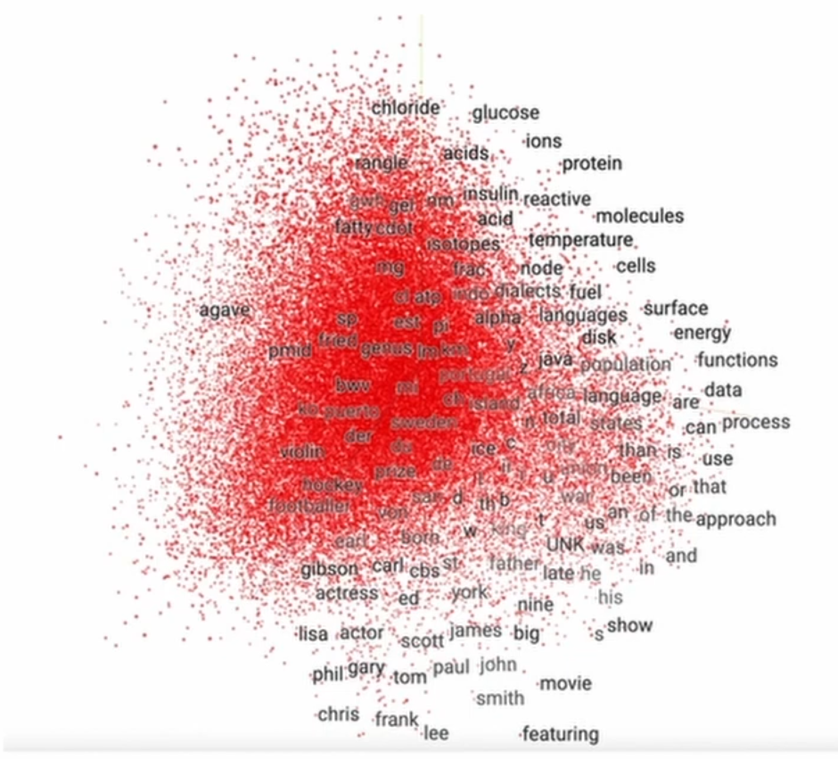
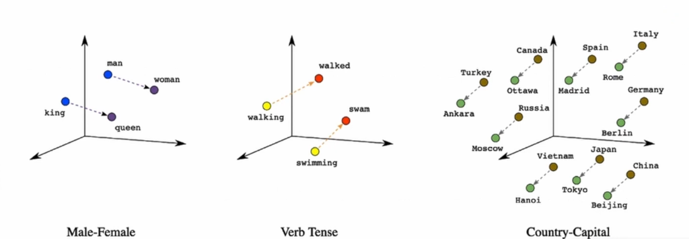

# Vector Stores

Vector databases are modern data management systems designed to store and retrieve high-dimensional vectors 
representing unstructured data.

## Introduction

### What is unstructured data
Unstructured data refers to information that doesn't have a predefined data model or organized format. Unlike 
structured data, which fits neatly into tables with rows and columns, unstructured data lacks a consistent structure, 
making it more challenging to store, process, and analyze using traditional databases and methods.
Unstructured data can take various forms, including:

1. Textual Data: This includes documents, emails, social media posts, and other text-based content that doesn't adhere 
to a strict structure.
2. Images and Videos: Visual content such as images and videos don't have a tabular structure and are considered 
unstructured data.
3. Audio: Audio recordings, like spoken conversations or music tracks, are also unstructured in nature.
4. Sensor Data: Data collected from various sensors, such as those in IoT devices, might not follow a predefined format.
5. Web Pages: Web pages often contain a mix of text, images, and other media, resulting in unstructured content.
6. Social Media Posts: Posts on platforms like Twitter, Facebook, and Instagram often contain text, images, and 
hashtags, with no uniform structure.
7. Free-Form Surveys: Open-ended survey responses where respondents can provide any kind of text-based answer are 
considered unstructured data.

Due to its diverse and variable nature, unstructured data poses challenges for traditional databases that are designed 
to handle structured data efficiently. Vector stores provide a solution to unstructured data by leveraging vector 
space relations.

### How does this work
Taking a set of textual data in the form of a set of PDF documents. 
Each document is broken down into a set of chucks of textual meaing. 
These chunks are presented as input to a Machine Learning model such as _Word2vec_ that 
transforms the chuck of textual data into a high dimensional vector. This vector becomes what is known as an **Embedding**.
This forms a numerical representation of the textual data.

**Embedding Def**: An embedding is a vector representation that encodes the underlying meaning behind unstructured data.

Take for example the below vector space generated from a set of words:

    

#### Embedding Arithmetic
Within a vector space, the embeddings are subject to the mathematics underlying laws of linear algebra.
The following linear algebra actions can be applied:

1. Vector Addition and Subtraction: Adding or subtracting vectors can highlight relationships between them. For example, in the context of word embeddings, the operation "king - man + woman" might result in a vector close to the "queen" vector, demonstrating the ability to capture analogies.
2. Cosine Similarity: Cosine similarity measures the cosine of the angle between two vectors. It quantifies the similarity between vectors in terms of their direction, not their magnitude. This is often used to find similarity between embeddings, like measuring the similarity between two text documents.
3. Nearest Neighbor Search: Given an embedding vector, a nearest neighbor search identifies other vectors in the dataset that are closest to the given vector in terms of Euclidean distance, cosine similarity, or other distance metrics. This is useful for recommendation systems and content retrieval.
4. Clustering: Grouping similar vectors together based on their proximity in the vector space is known as clustering. K-means clustering and hierarchical clustering are common techniques used with embeddings to group similar data points.
5. Principal Component Analysis (PCA) and Dimensionality Reduction: PCA is a technique to reduce the dimensionality of the data while preserving its most important variations. It can be applied to embeddings to simplify visualization and analysis while retaining essential information.
6. Arithmetic Operations on Image Embeddings: In computer vision, embeddings can represent images. You can perform arithmetic operations on these embeddings to achieve interesting effects, like image style transfer or morphing.
7. Time Series Analysis: Embeddings of time series data can be used to detect patterns and anomalies, aiding in forecasting and anomaly detection tasks.
8. Text Similarity and Sentiment Analysis: By measuring the similarity between text embeddings, you can gauge the semantic similarity between different text documents. This is used in sentiment analysis, text classification, and recommendation systems.
9. Interpolation and Extrapolation: By linearly interpolating between two embeddings, you can generate new embeddings representing intermediate states. Extrapolation extends this to create embeddings representing points beyond the original data distribution.
10. Attention Mechanisms: In natural language processing, attention mechanisms leverage vector actions to assign different weights to different parts of a sequence, allowing models to focus on specific elements during tasks like translation or text summarization.
11. Correlation: Correlation between vectors within the space can reveal underlying semantics and relations within the vector space. The example below visualizes this concept

    

Source: The Evolution of Milvus: A Cloud-Native Vector Database - Frank Liu, Zilliz

    

Source: The Evolution of Milvus: A Cloud-Native Vector Database - Frank Liu, Zilliz

### Process Summary
1. Text Embedding: Before storage, the textual data is transformed into numerical representations called text embeddings. This conversion involves techniques like Word2Vec, GloVe, or more advanced language models like BERT or GPT, which map words or phrases to dense vectors in a semantic space.
2. Vector Representation: Each text embedding becomes a vector in a high-dimensional space, where the dimensions correspond to different features or aspects of the text's meaning. Words or phrases with similar meanings are positioned closer to each other in this vector space.
3. Indexing: Vector databases employ specialized indexing structures optimized for vector data. These indexes store information about the vectors' positions, allowing for efficient retrieval of similar vectors or nearest neighbors.
4. Similarity Search: When querying the database with a specific text, the query text is transformed into a vector using the same embedding technique. The database then performs a similarity search, identifying the nearest vectors in the high-dimensional space to the query vector. These nearest vectors represent texts with similar semantic content.
5. Ranking and Retrieval: The retrieved vectors are ranked based on their similarity to the query vector. The top-ranked vectors represent the most similar texts, and these can be returned as search results.
6. Applications: Vector databases storing textual data find applications in various fields. They power search engines, recommendation systems, content similarity detection, sentiment analysis, and more, where understanding the semantic relationships between texts is crucial.

## Potential Vector Storage Solutions

### Pinecone
Link: [https://www.pinecone.io/](https://www.pinecone.io/)

Pinecone is a cloud-based vector database and similarity search service that enables fast and scalable retrieval of high-dimensional vectors. It's designed to simplify the implementation of similarity search and recommendation systems.

#### Pros:
1. Scalability: Pinecone is a cloud-native service, offering automatic scaling and load balancing to handle growing amounts of data and queries.
2. Efficient Search: It provides fast and accurate similarity search operations, delivering real-time results for nearest neighbor queries.
3. Ease of Use: Pinecone abstracts complex vector indexing and search processes, making it easier to integrate similarity search capabilities into applications.
4. Versatility: Suitable for various applications like recommendation engines, content personalization, anomaly detection, and more.
5. Indexing Methods: Pinecone offers different indexing methods, such as HNSW (Hierarchical Navigable Small World), allowing users to optimize performance based on their data characteristics.

#### Cons:
1. Cloud Dependency: As a cloud-based service, Pinecone requires internet connectivity and relies on the cloud provider's infrastructure.
2. Data Privacy and Security: Users need to consider data privacy and security implications when using cloud services to store and manage their data.
3. Costs: Depending on the volume of data and usage, cloud-based services like Pinecone may incur costs.
4. Learning Curve: While Pinecone simplifies similarity search, users might still need some learning to effectively integrate and utilize the service.

### Chroma
Link: [https://docs.trychroma.com/](https://docs.trychroma.com/)

Chroma is an open-source, AI native, local-based embeddings database. 

#### Pros:
1. Scalability: Chroma is a local service with capability to be hosted as a cloud-solution.
2. Ease of Use: Chroma provides a simple and intuitive interface with which to interact with the Vector database.
3. Feature rich: The simple interface by no means limits the available features within Chroma, with capabilities equalling the other listed software.
4. Well documented: Chroma provides excellent and rich documentation specifying steps and process to achieve desired goals and states. 
5. Open-source: No cost associated with the solution and a team of like-minded individuals working on and with the solution. 

#### Cons
- Complexity in scaled deployment: Scaling the deployment of Chroma may be difficult in comparison to an automated solution such as Pinecone
- Throughput limitations: To achieve the same rate of throughput as managed systems such as Pinecone, the Chroma DB will require additional work.

Sources:
- [https://medium.com/@woyera/pinecone-vs-chroma-the-pros-and-cons-2b0b7628f48f](https://medium.com/@woyera/pinecone-vs-chroma-the-pros-and-cons-2b0b7628f48f)

### Milvus
Link: [https://milvus.io/](https://milvus.io/)

Milvus is an open-source vector database designed for storing and managing high-dimensional vector data. It aims to 
provide efficient similarity search and analytics capabilities on large-scale datasets. Milvus can be deployed 
locally and in the cloud.

#### Pros:
1. High-Dimensional Data Storage: Milvus specializes in storing and managing high-dimensional vectors, making it well-suited for applications like image recognition, natural language processing, and more.
2. Variety of Indexes: It offers various indexing methods optimized for different types of queries and data structures, such as IVF (Inverted File), HNSW (Hierarchical Navigable Small World), and more.
3. Scalability: Milvus is designed for large-scale datasets and supports horizontal scalability, allowing it to handle growing amounts of data.
4. Query Acceleration: Milvus provides efficient similarity search operations, enabling fast retrieval of nearest neighbors and similar vectors.
5. Community and Support: Being open-source, Milvus benefits from community contributions and ongoing development, with documentation and resources available for users.

#### Cons:
1. Setup and Configuration: Like many specialized tools, setting up and configuring Milvus might require familiarity with its features and parameters.
2. Resource Consumption: Depending on the chosen indexing method and the scale of data, Milvus might consume memory and computational resources.
3. Learning Curve: New users might need time to understand the best practices for data modeling, indexing, and query optimization to achieve optimal performance.
4. Maintenance: While open-source communities contribute to its development, maintaining and updating Milvus to address specific use cases could involve effort.

### FAISS
Link: [https://ai.meta.com/tools/faiss/](https://ai.meta.com/tools/faiss/)

FAISS is an open-source library developed by Facebook AI Research for efficient similarity search and clustering of 
high-dimensional vectors. It offers various indexing structures and search algorithms optimized for 
large-scale nearest neighbor search tasks. The library is intended for local use, with the capability to be hosted.

#### Pros:
1. High Efficiency: FAISS is optimized for speed and can perform fast similarity searches, making it suitable for large datasets and real-time applications.
2. Variety of Indexes: The library provides a range of indexing structures, such as IVF (Inverted File) and HNSW (Hierarchical Navigable Small World), enabling users to choose the best fit for their data and use case.
3. Parallel Processing: FAISS supports parallel processing, taking advantage of multi-core CPUs and GPUs for faster computation.
4. Memory Efficiency: FAISS is designed to efficiently use memory resources, enabling efficient indexing and retrieval even for large datasets.
5. Scalability: It is built to handle large-scale datasets and can be integrated into distributed computing environments.
6. Active Development: Being an open-source project developed by Facebook AI Research, FAISS benefits from ongoing updates and improvements from a community of contributors.

#### Cons:
1. Complex Configuration: Proper configuration of indexes and search parameters can require domain expertise for optimal performance.
2. Learning Curve: Utilizing the full potential of FAISS may require understanding its various indexing options and tuning parameters.
3. Resource Consumption: While memory-efficient, some index structures can still consume significant memory, which might be a consideration for resource-constrained environments.
4. GPU Dependency: For GPU-accelerated performance, using FAISS with compatible hardware is recommended.

### HNSWLIB
Link: [https://github.com/nmslib/hnswlib](https://github.com/nmslib/hnswlib)

HNSWLIB (Hierarchical Navigable Small World Library) is a local library, meaning it is designed to be used within a 
specific software application or environment on a local machine. 
It is not inherently cloud-based, but you can certainly deploy applications that use HNSWLIB on cloud 
infrastructure if needed. 
The library provides functionalities for building and searching nearest neighbor index structures locally, 
allowing for efficient nearest neighbor search operations on high-dimensional data within the context of the 
application it's integrated into.

#### Pros:
1. Efficient High-Dimensional Search: HNSWLIB excels at finding nearest neighbors in datasets with many dimensions, overcoming the "curse of dimensionality" that affects traditional methods.
2. Scalability: It scales well to large datasets, making it suitable for applications with substantial amounts of data.
3. Balanced Performance: HNSWLIB strikes a good balance between accuracy and speed, offering the option to adjust parameters to optimize search results according to application needs.
4. Versatility: It finds applications in vector databases, recommendation systems, information retrieval, and more.
5. Real-time and Batch Processing: Suitable for both real-time scenarios and batch processing, catering to different application requirements.

Cons:
1. Configuration Complexity: Fine-tuning parameters for optimal performance may require domain expertise and experimentation.
2. Memory Consumption: Constructing and maintaining the navigable graph structure can consume memory, potentially affecting its suitability for resource-constrained environments.
3. Trade-off between Speed and Accuracy: Adjusting parameters for faster search times may lead to slight compromises in search accuracy.

### Choice Rationality
Pinecone offers a ready-to-go service free for a reasonable quantity of data. This enables us to test the system to determine
if it is succesful. From that point design decisions can be made to switch to an open-source self-managed vector database. 
The choice of vector storage will be re-assessed at a later point. 

## Sources
- [The Evolution of Milvus: A Cloud-Native Vector Database - Frank Liu, Zilliz](https://youtu.be/4yQjsY5iD9Q?si=u58fMUuCaL1oDoN4)
- [https://blog.devgenius.io/an-evaluation-of-vector-database-systems-features-and-use-cases-9a90b05eb51f](https://blog.devgenius.io/an-evaluation-of-vector-database-systems-features-and-use-cases-9a90b05eb51f)

